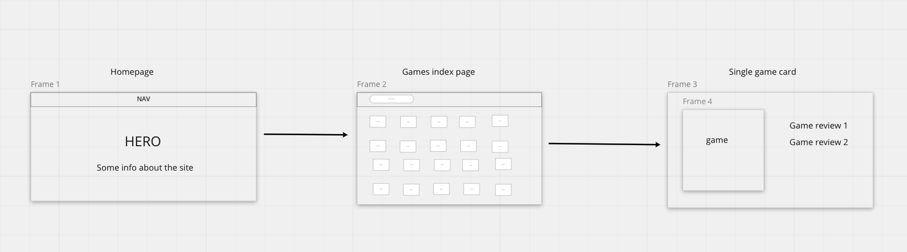
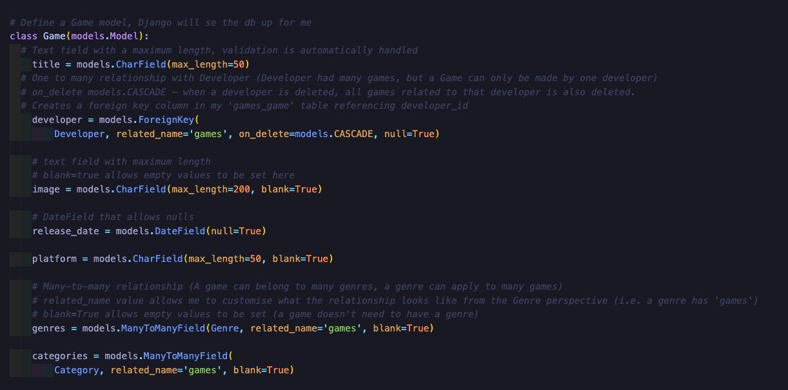
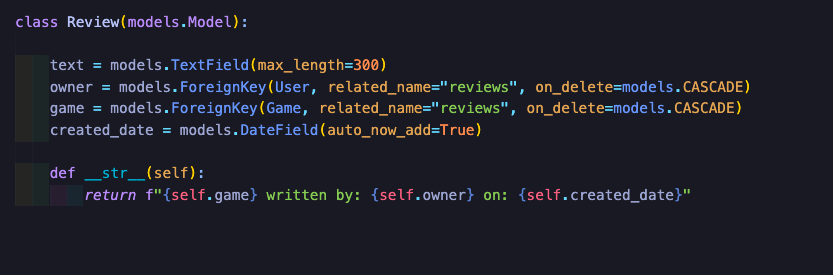
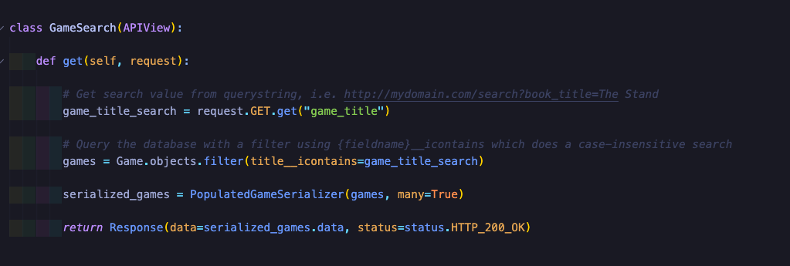
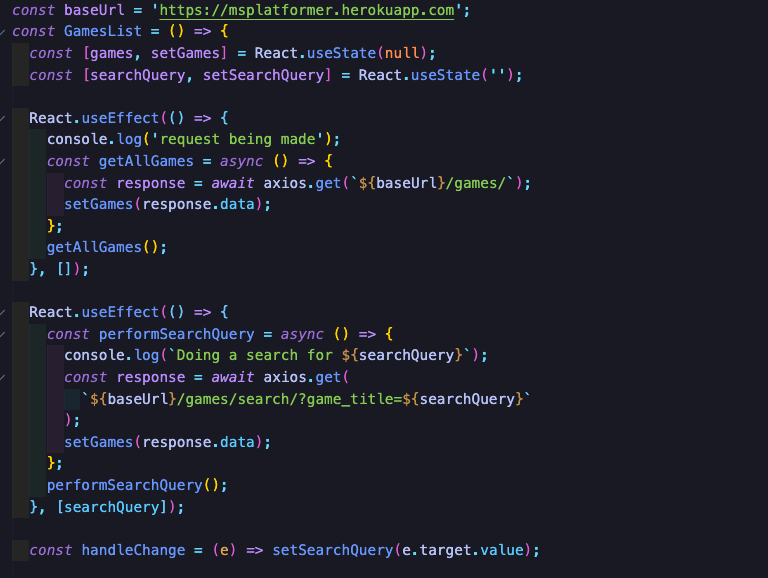

# Platformer - SEI Project 4 - Solo

Link to App: [Platformer](https://tinyurl.com/2p92546r)

For the final GA project, I was tasked with creating a full-stack app with React on the frontend, and a backend built with Django.

Platformer is a Metacritic-style video games reviews site that is parent-focussed, where users can read reviews of video games before purchasing for their children.

## The Brief

- Build a full-stack application by making your own backend and your own front-end
- Use a Python Django API using Django REST Framework to serve your data from a Postgres database
- Consume your API with a separate front-end built with React
- Be a complete product which most likely means multiple relationships and CRUD functionality for at least a couple of models
- Implement thoughtful user stories/wireframes that are significant enough to help you know which features are core MVP and which you can cut
- Have a visually impressive design
- Be deployed online so it's publicly accessible
- Write your code DRY and build your APIs RESTful.

## Timeframe

10 Days

## Technologies used

- Django
- Django REST Framework
- PostgreSQL
- PyJWT
- JavaScript (ES6)
- React.js
- HTML
- Bulma
- Axios
- Git
- GitHub
- react-router-dom

## Getting started

Click the Code button above to download the source code, and in the terminal enter the following commands:

- To install all the dependencies listed in the package.json: - $ npm i
- Navigate into the shell - $ pipenv shell
- Run the app on localhost:8000 - $ python manage.py runserver
- Check the console for any issues and if there are any then check the package.json for any dependencies missing
- Navigate to http://localhost:8000/

In order to see reviews, the user can navigate to the games page, find the game either by scrolling, or by typing in the search bar which will filter out the desired game from the index. After selecting a game, the user gets taken to the game card page where they’ll be able to see reviews, platform, release year and most importantly what category the game falls in (ie if a game contains violence, or if a game is suitable for all ages).

## Functionality

Like most reviews sites, the user has access to:

- A curated feed of Video games
- View a show-page of a game
- Read reviews by other users

# Process

## Day 1 - 2

Before building the project, I did some research on popular reviews sites like Metacritic, Steam reviews, and IMDB to gain some insight on how the page's design might go. Following this I designed wireframes for the app, aiming to see how the site navigation would flow, and established what the Entity Relationship Diagram might look like for my database.

## Day 3 - 7

Timeframe: 5 days

I started the development process by building my models, views and serializers in Django to create a SQL database. I spent most of the project time working on the database because I wanted to ensure that it was all working as I wished, and the relationships I had planned were suitable for the functionality I had designed. I used TablePlus to visualise my PostgreSQL database, and Postman to test my backend requests, making sure all relationships between models were working.

## Day 8 - 10

Timeframe: 2 days

After getting my database in a pretty good state, I decided to move onto my frontend, I started by building the App, Home, Games and Login components. By using axios on my frontend, I was able to request data to my backend API, which is made to an endpoint. For the page navigation, I used the react-router-dom.

## Styling

By the time it came to styling my app, I was up and against the clock somewhat, and decided to go with Bulma as it enabled a quick turnaround code-wise and comes responsive out of the box, which is nice.

## Featured code

In order for my frontend to GET the correct request, I created a Game model with d different SQL relationships - Many-to-Many (developer), Many-To-Many (genres) and One-To-Many (reviews).

Another piece of code that I am quite happy with is my GameSearch API view which allows me to get data from a querystring, and also allows me to query the database with a filter.

And on the frontend by writing some search functionality.

## Known Bugs or errors

The login page is WIP, I ran out of time to fully flesh out the functionality, and also to implement a register page. I’m working on implementing these features to the app currently.

## Wins

Working out the SQL database relationships was not as bad as I initially thought, I had previous experience working with relationships in project 3 albeit with a MongoDB database, using SQL made the entire experience more pleasant this time around. Especially working with Serializers and models with multiple relationships.

## Future features

Fix functionality for the login, add registration page, and add a feature which allows logged in users to post their own reviews. Aim to make the app responsive in order to cater to smaller screens.

## Key learnings

Creating a full-stack app solo, and in 10 days was most certainly a challenge. I didn't have the luxury of collaborative work, but honestly I really enjoyed the process of seeing my vision come to life from the initial whiteboarding to deployment.

Managing my workload was a learning curve for me, the project taught me how to manage a little piece of work at a time, and to refrain from bouncing from one idea to the next. Albeit there were indeed some trade-offs working solo, not having the luxury of debugging with a teammate, or generally asking for a second opinion/advice during the process was something I missed.
